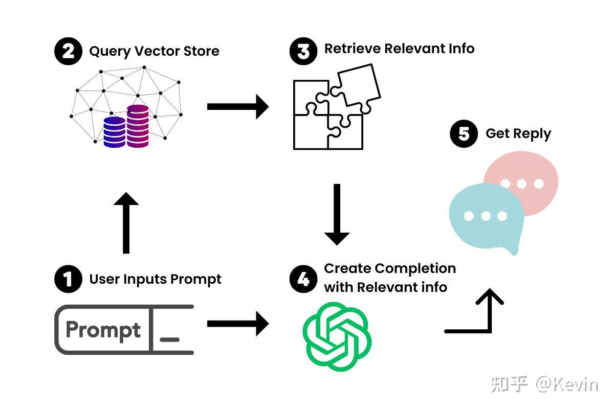

LangChain
===

# 基本原理

简单来说，LangChain就是把大量的数据组合起来，让LLM能够尽可能少地消耗计算力就能轻松地引用。它的工作原理是把一个大的数据源，比如一个50页的PDF文件，分成一块一块的，然后把它们嵌入到一个向量存储（Vector Store）里。

现在我们有了大文档的向量化表示，我们就可以用它和LLM一起工作，只检索我们需要引用的信息，来创建一个提示-完成（prompt-completion）对。

当我们把一个提示输入到我们新的聊天机器人里，LangChain就会在向量存储里查询相关的信息。你可以把它想象成一个专门为你的文档服务的小型谷歌。一旦找到了相关的信息，我们就用它和提示一起喂给LLM，生成我们的答案。

angChain还可以让你创建一些可以执行动作的应用程序，比如上网、发邮件、完成其他API相关的任务。你可以看看AgentGPT，这是一个很好的例子。

# 参考文献
1. [langchain中文说明文档](https://github.com/liaokongVFX/LangChain-Chinese-Getting-Started-Guide)
2. [langchain官方github](https://github.com/langchain-ai/langchain)
3. [langchain帮助文档](https://www.langchain.asia/)
4. [langchain官方帮助文档](https://python.langchain.com/docs/get_started/introduction)
5. [LangChain：一个让你的LLM变得更强大的开源框架](https://zhuanlan.zhihu.com/p/636043995)

