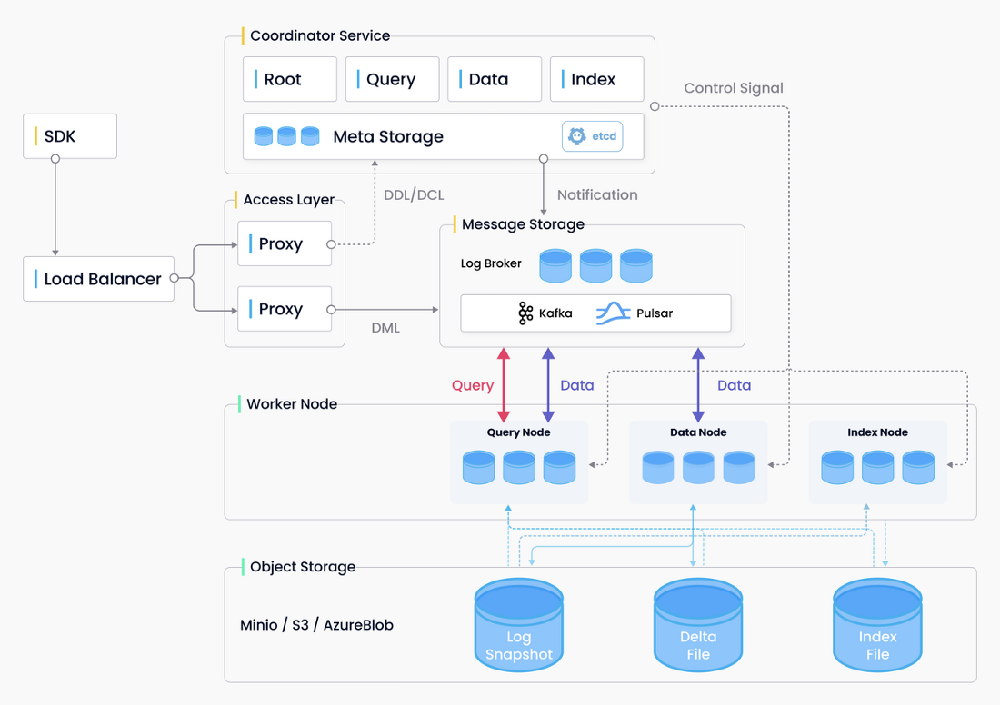

向量数据库
===
简单下个定义，因为喂给Transformer的知识首先需要做embedding，所以用于存储embedding之后数据的数据库即可称为向量数据库。

# 常见向量数据

## Pinecone: 一个全托管的矢量数据库
https://www.pinecone.io/

Pinecone是一个专门为工程师与开发者设计的向量数据库。 作为一个全托管的服务，它减轻了工程师以及运维人员的负担，使得客户可以聚焦于数据内在价值的抽取。 免费版可以支持500w的向量存储，其用法简单，价格低廉，可以快速支持向量检索业务的验证与尝试。在特性上Pinecone也具有高速、准确以及可拓展等特性，此外也具备对单级元数据过滤和尖端稀疏-密集索引等高级功能。

## Weaviate
https://github.com/weaviate/weaviate

https://weaviate.io/

weaviate 是一个开源的矢量数据库，具有健壮、可拓展、云原生以及快速等特性

## Qdrant
https://github.com/qdrant/qdrant

Qdrant 是面向下一代的生成式AI向量数据库，同时也具备云原生的特性。

## Milvus
https ://milvus.io/

Milvus 实现了四层：接入层、协调服务、工作节点和存储。这些层是独立的，以实现更好的可扩展性和灾难恢复.

极高的检索性能: 万亿矢量数据集的毫秒级搜索非结构化数据的极简管理丰富的API跨平台实时搜索和分析可靠：具有很高的容灾与故障转移能力高度可拓展与弹性支持混合检索统一的Lambda架构社区支持、行业认可

#总结
综上所属， 在几个主流的向量数据库中， milvus在大规模、检索性能、社区影响力等方面都具备绝对优势，其分布式架构也更Match下一代存储的理念。

Weaviate在使用案例上，有很多现成的例子，跟当前GPT前沿热门项目贴合比较紧秘，但在大规模生产环境使用场景中，还需要接受考验。

Chroma是一个很轻量级的数据库，底层使用了clickhouse、duckdb等存储引擎.

# 参考文献
1. [主流向量数据库一览](https://zhuanlan.zhihu.com/p/628148081)
2. [Pinecone](https://www.pinecone.io/)
3. [Weaviate](https://weaviate.io/)
4. [Qdrant](https://github.com/qdrant/qdrant)
5. [Milvus](https://milvus.io/)