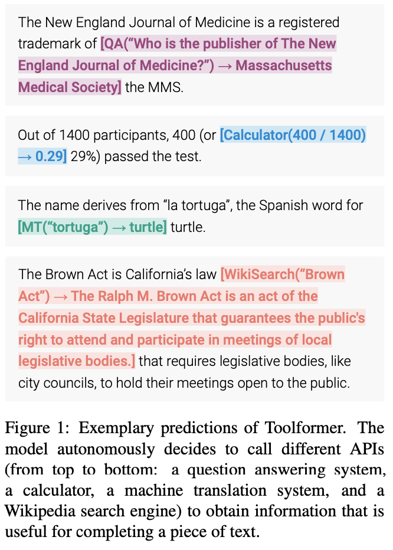
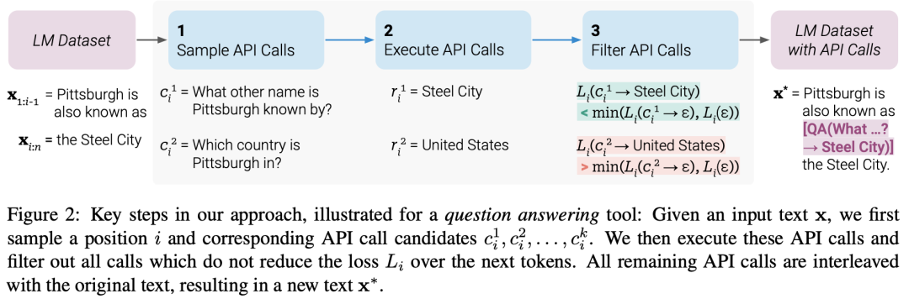
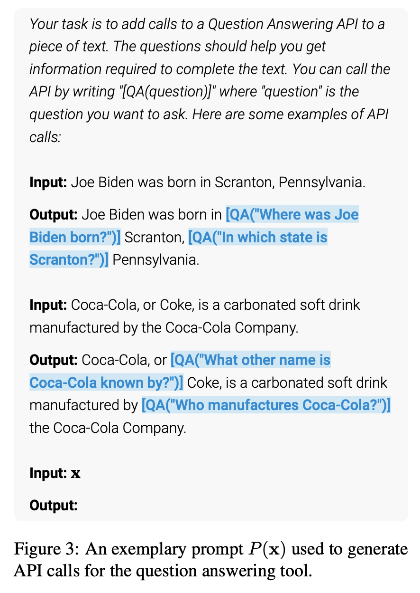

# ToolFormer
## 背景
大语言模型（LLM）在利用有限的文本数据解决新任务方面表现出令人难以置信的优势。然而，尽管如此，它们在其他方面也有局限性，例如：
- 无法访问最新信息
- 幻想事实的倾向
- 低资源语言的困难
- 缺乏精确计算的数学技能
- 对时间进程的不了解

##ToolFormer
什么是 Toolformer 呢？简而言之，Toolformer 是一个可以自学使用工具的语言模型。

Toolformer 基于一个预先训练的 GPT-J 模型，包含 67 亿个参数，使用自监督学习方法进行训练。这种方法包括采样和过滤 API 调用，以增加现有的文本数据集。

Toolformer 希望通过以下两个要求来完成 LLM 自学如何使用工具的任务：

工具的使用应该通过自我监督的方式来学习，而不需要大量的人工注释。
LM 不应丧失其一般性，应该能够自行决定何时以及如何使用哪种工具。
下图显示了 Toolformer 的预测（例如，在数据样本中嵌入的 API 调用）：

## Toolformer 的架构和实现方法
Toolformer 是一个大型语言模型，它能够通过 API 调用使用不同的工具。每个 API 调用的输入和输出需要格式化为文本/对话序列，以便在会话中自然流动。

从上面的图片中可以看到的，Toolformer 首先利用模型的上下文学习能力来对大量潜在的 API 调用进行采样。

执行这些 API 调用，并检查获得的响应是否有助于将来预测 token，并被用作筛选条件。经过过滤之后，对不同工具的 API 调用被嵌入到原始数据样本中，从而产生增强的数据集，而模型就是在这个数据集上进行微调的。

具体地，上图显示了使用问答工具完成此任务的模型：
1. LM 数据集包含示例文本: 为“Pittsburgh is also known as”输入提示“Pittsburgh is also known as The Steel City”。
2. 为了找到正确的答案，模型需要进行一个 API 调用并正确地进行调用。
3. 对一些 API 调用进行了抽样，特别是“ What other name is Pittsburgh known by?”和“ Which country is Pittsburgh in?”。
4. 相应的答案是“Steel City”和“United States”。因为第一个答案更好，所以它被包含到一个新的 LM 数据集中，并带有 API 调用: “Pittsburgh is also known as [QA(”What other name is Pittsburgh known by?”) -> Steel City] the Steel City”。
5. 这包含预期的 API 调用和应答。重复此步骤以使用各种工具(即 API 调用)生成新的 LM 数据集。
因此，LM 使用嵌入在文本中的 API 调用来注释大量数据，然后使用这些 API 调用对 LM 进行微调，以进行有用的 API 调用。这就是自监督训练的方式，这种方法的好处包括:

- 更少需要人工注释。
- 将 API 调用嵌入到文本中允许 LM 使用多个外部工具来添加更多内容。

Toolformer 然后学会预测每个任务将使用哪个工具。

## 算法流程
### API 调用的采样
下图显示了给定用户输入的情况下，Toolformer使用和来表示API调用的开始和结束。为每个API编写一个提示符，鼓励Toolformer使用相关的API调用对示例进行注释。

Toolformer为每个token分配一个概率，作为给定序列的一个可能的延续。该方法通过计算ToolFormer分配给在序列中每个位置启动API调用的概率，对API调用的最多k个候选位置进行采样。保持概率大于给定阈值的位置，对于每个位置，通过使用以API调用为前缀、以序列结束标记为后缀的序列从Toolformer采样，最多可获得m个API调用。
### API调用的执行
API调用的执行完全取决于正在执行调用的客户端。客户端可以是不同类型的应用程序，从另一个神经网络、Python脚本，到在大型语料库中搜索的检索系统。需要注意的是，当客户端发出调用时，API会返回一个单一的文本序列响应。此响应包含有关调用的详细信息，包括调用的成功或失败状态、执行时间等。

因此，为了获得准确的结果，客户端应该确保提供正确的输入参数。如果输入参数不正确，API可能会返回错误的结果，这对于用户来说可能是不可接受的。另外，客户端还应该确保与API的连接是稳定的，以避免在调用期间发生连接中断或其他网络问题。

### 过滤API调用
在过滤过程中，Toolformer通过API调用后的token计算Toolformer的加权交叉熵损失。

然后，比较两种不同的损失计算:

(i)一种是API调用，其结果作为输入给Toolformer

(ii)一种是没有API调用或者API调用但没有返回结果。

如果为API调用提供输入和输出，使得Toolformer更容易预测未来的token，那么API调用就被认为是有用的。应用过滤阈值仅保留两个损失之间的差值大于或等于阈值的API调用。

### 模型微调
最后，Toolformer将剩余的API调用与原始输入合并，并创建一个新的API调用来增强的数据集。换句话说，增强的数据集包含与原始数据集相同的文本，只插入了API调用。

然后，使用新的数据集使用标准语言建模目标对ToolFormer进行微调。这样可以确保在增强的数据集上微调模型会暴露给与在原始数据集上微调相同的内容。通过在准确的位置插入API调用，并使用帮助模型预测未来token的输入，对增强数据的微调使语言模型能够了解何时以及如何根据自己的反馈使用API调用。

### 推理
在推理过程中，当语言模型产生“→”token时，解码过程被中断，这表明 API 调用的下一个预期响应。然后，调用适当的 API 来获取响应，并在插入响应和token之后继续解码。

此时，我们需要确保获取的响应与上一个token所期望的响应相匹配。如果不匹配，我们需要调整 API 调用以获得正确的响应。在继续解码之前，我们还需要执行一些数据处理来准备下一步的推理过程。这些数据处理包括对响应的分析、对上下文的理解以及对推理路径的选择。因此，在推理过程中，不仅需要调用 API 来获取响应，还需要进行一系列的数据处理和分析，以确保推理过程的正确性和连贯性。

### API工具
Toolformer 中每个可以使用的API工具都要满足以下两个条件：

- 输入/输出都需要表示为文本序列。
- 有可用的演示表达如何使用这些工具。

Toolformer 的初始实现中支持了五个API工具：

1. 问答回答：这是另一个LM，可以回答简单的事实问题。
2. 计算器：目前只支持4个基本的算术运算，并四舍五入到小数点后两位。
3. Wiki搜索：返回从维基百科剪切下来的短文本的搜索引擎。
4. 机器翻译系统：一个可以将任何语言的短语翻译成英语的LM。
5. 日历：对日历的API调用，该调用返回当前日期而不接受任何输入。

## ToolFormer 的局限
Toolformer 仍然存在一些局限性，例如无法同时使用多个工具、无法处理返回结果过多的工具、对输入措辞敏感导致效率低下、未考虑使用成本可能导致高计算成本等问题。具体如下:

1. 由于每个工具的 API 调用都是独立生成的，因此 Toolformer 无法在一个流程中使用多个工具。
2. 特别是对于可能返回数百个不同结果的工具（如搜索引擎），Toolformer 不能以交互方式使用。
3. 使用 Toolformer 进行训练的模型对输入的确切措辞非常敏感，这种方法对于某些工具来说效率很低，需要大量的文档以生成少量有用的 API 调用。
4. 在决定使用每个工具时，没有考虑使用它的成本，这可能会导致较高的计算成本。

# 参考文献
1. https://www.51cto.com/article/753521.html
2. https://arxiv.org/pdf/2302.04761.pdf
3. https://github.com/lucidrains/toolformer-pytorch