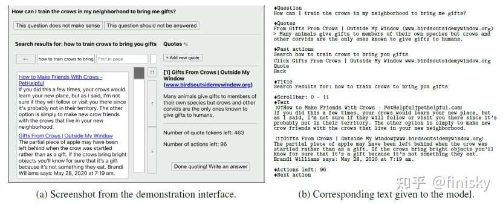
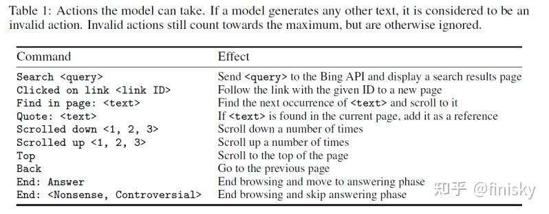

# WebGPT
WebGPT是OpenAI在2021年底发布的解决long-form quesion-answering (LFQA) 的方案。WebGPT想解决什么问题？让开放域QA回复更长更可靠。
WebGPT的思路类似 Knowledge-Grounded Conversation，利用搜索引擎做相关文档检索，从而生成更长的答案。主要的两个贡献：
1. 微调的语言模型可以与一个基于文本的Web浏览环境交互，从而可以端到端地使用模仿和强化学习优化检索和聚合效果。
2. 参考Web检索出来的信息生成回复。labeler可以根据检索出来的信息判断factual准确率，降低了独立调研问题正确性的难度。

## Web交互设计及工作流程
所谓text-based web-browsing environment长这样，也就是模型与Web交互的界面：

如上图右边所示，模型输入是一段prompt，包含问题、当前位置的文本、过去的actions、标题等等信息。作为响应，模型必须输出下列action之一：

重复上述过程，并且上下文信息只在summary中出现。这些action中有一个是Quote，它会将标题、领域等等信息记录下来作为将来模型输入使用。这个过程继续直到end browsing出现，或超过最大action数，或达到reference最大长度，模型就进入生成阶段，生成最终回复。

## 训练方法
### 数据收集
训练数据分为两部分，demonstrations和comparisons:
- demonstrations: 预训练语言模型不会使用Web浏览，所以需要收集真人使用搜索引擎回答问题的数据。
- comparisons: 训练后发现，只用demonstrations并不能直接提升回复质量。所以收集了对同一问题模型生成的多个回复，并标注哪个更好，这种数据就是comparisons。

所谓comparisons数据与InstructGPT的RLHF思想一致，主要动机是让模型判别哪个答案更优。

### 训练
训练主要基于之前GPT-3预训练模型的三个版本：760M, 13B 和 175B。训练方法如下：

- Behavior cloning (BC): 用demonstrations数据，以真人输出的command为目标finetune模型。
- Reward modeling (RM): 基于BC，将最后的非嵌入层去掉，以question/answer/reference为输入，scalar为输出，训练一个RM。
- Reinforcement learning (RL): 使用PPO算法，finetune BC模型。
- Rejection sampling (best-of-n): 从BC或RL模型采样固定数目的答案，取RM打分最高的一个作为优化RM的替代方案。

可见，训练的前三步与InstructGPT完全一致，唯一区别就是第一步的BC模型与SFT模型所用训练数据不同。

### 结论
- 使用搜索引擎可以显著提高对话回复的真实性和信息量。这一点在LaMDA/CharacterAI/WebGPT和上文提到的ACL2022论文中都得以验证。
- Human-feedback，或者说comparison对模型效果提升至关重要。这一点在InstructGPT/ChatGPT/WebGPT和百度的Diamonte上都得以验证。

# 参考文献
1. https://arxiv.org/abs/2112.09332
2. [如何看待 OpenAI 近期公开的 WebGPT 模型？](https://www.zhihu.com/question/506813687)
3. [WebGPT 简读](https://zhuanlan.zhihu.com/p/591565418)
4. [WebGPT简介](https://zhuanlan.zhihu.com/p/612276089)
5. https://www.microsoft.com/en-us/bing/apis/bing-web-search-api