# SAM
sam是一个无监督的分割图像的基础模型，分割效果非常好，具体细节可看论文解读。
分割一切模型汇总

## 整体项目汇总
1. [dk-liang/Awesome-Segment-Anything](https://github.com/dk-liang/Awesome-Segment-Anything)
2. [liliu-avril/Awesome-Segment-Anything](https://github.com/liliu-avril/Awesome-Segment-Anything)
3. [VainF/Awesome-Anything](https://github.com/VainF/Awesome-Anything)
4. [Hedlen/awesome-segment-anything](https://github.com/Hedlen/awesome-segment-anything)
5. [Vision-Intelligence-and-Robots-Group/Awesome-Segment-Anything]()
6. [JerryX1110/awesome-segment-anything-extensions](https://github.com/JerryX1110/awesome-segment-anything-extensions)

## 1. 图像分割
### 1.1 集成文本模型，辅助检测
1. [Grounded Segment Anything](https://github.com/IDEA-Research/Grounded-Segment-Anything)

集成sam，可以通过文本提示做检测/分割等任务。

- GroundingDINO：通过文本进行检测，如下图所示：
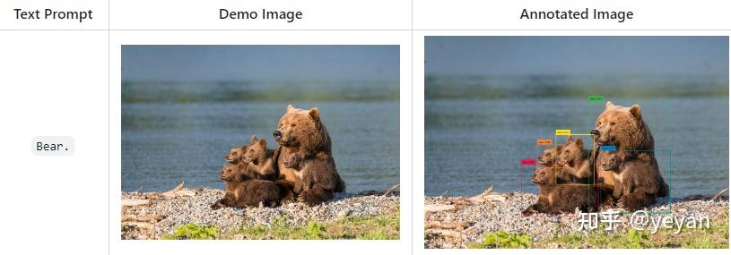
  
- Grounded-SAM:通过文本提示，检测和分割一切，先通过文本得到检测box，然后将检测的box输入到sam，得到mask。
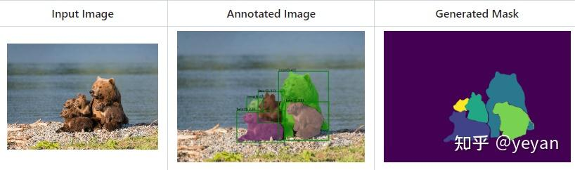
  
- Grounded-SAM图像编辑，将检测到的mask替换成其他。
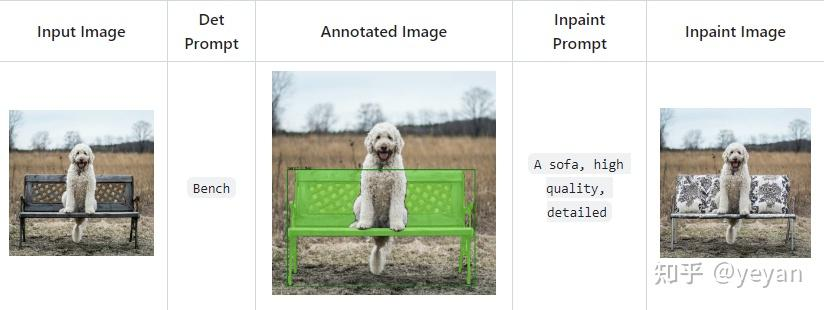
  

2. [segment-anything-u-specify](https://github.com/MaybeShewill-CV/segment-anything-u-specify)

集成sam和clip，实际测试官方提供的数据效果不错，自己的数据效果不理想。发现需要调参，具体看代码config里边的PRED_IOU_THRESH，STABILITY_SCORE_THRESH，CLS_SCORE_THRESH等参数。
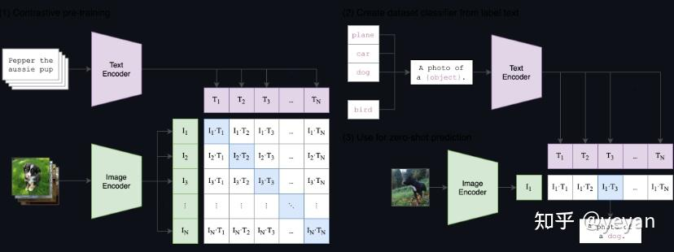
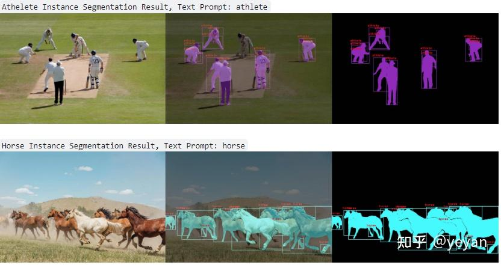

3. [segment-anything-with-clip](https://github.com/Curt-Park/segment-anything-with-clip)
主要流程：sam生成mask，然后裁切所有object，得到crop后的image feature和clip的query feature，计算2这的score，进行匹配。
   
个人测试，同样的数据，该方法效果好一些，发现和上边一篇流程一样，主要区别在于参数。
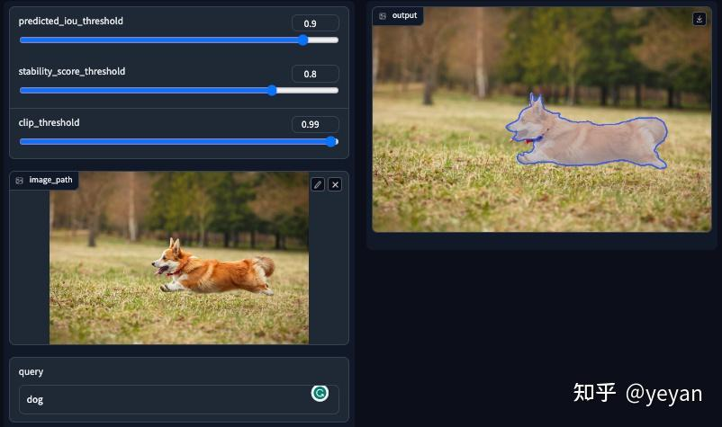

### 1.2 分割结果增加标签
[Semantic-Segment-Anything](https://github.com/fudan-zvg/Semantic-Segment-Anything)

其架构如下图所示，通过一个分割的分支得到边界粗糙但类别准确的mask，然后另一个分支通过sam预测无标签的mask，通过语义投票模块（裁剪出mask对应区域得到类别，取top-1的类别作为mask的类别），合并2个分支的mask和标签，得到有标签的mask 。
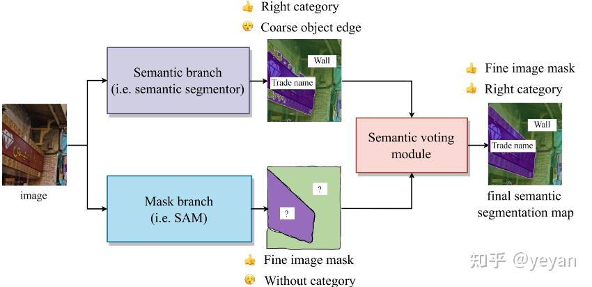

### 1.3 辅助instance segmentation
[Prompt-Segment-Anything](https://github.com/RockeyCoss/Prompt-Segment-Anything)
Prompt-Segment-Anything:集成检测模型，先用检测模型得到label和box，然后用box作为prompt，得到instance的mask。
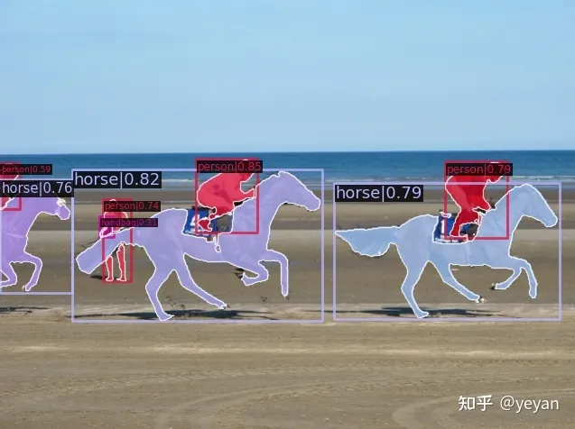

### 1.4 医学影像
由于sam在医学影像上表现不是特别好，在该类型数据集上就需要再训练。

- [MedSAM](https://github.com/bowang-lab/MedSAM)：提供了在医学数据集上的微调流程，具体可以参考[medsam视频教程](https://drive.google.com/file/d/1EvVBTSa9L7pDTmUOp-MHXxGD1lrU9Txk/view)。
- [SAM-Adapter-PyTorch](https://github.com/tianrun-chen/SAM-Adapter-PyTorch): 采用adapter机制，主要加在image encoder模块，效果还是不错的。该方法不仅适用于医学数据，也同样在隐蔽物等其他数据集上达到了不错的效果。具体可以参考[SAM-Adaptor项目链接](https://tianrun-chen.github.io/SAM-Adaptor/)。
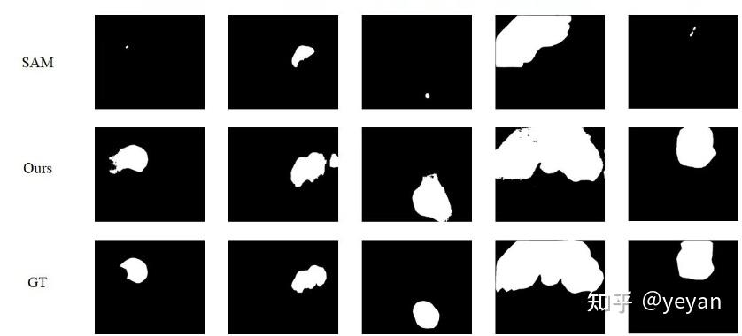
  
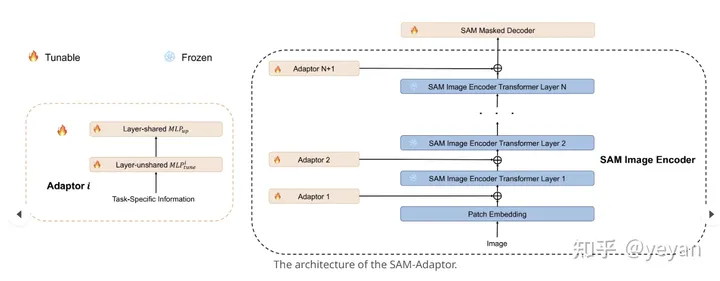

- [Medical-SAM-Adapter](https://github.com/WuJunde/Medical-SAM-Adapter):
  同上，也是采用了adapter机制。只不过插入adapter的模块稍有不同。
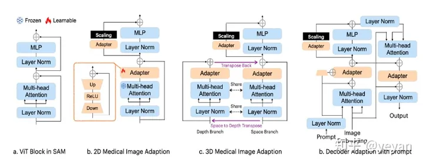

# 参考文献
1. [Segment Anything(sam)项目整理汇总[2023.7.15]](https://zhuanlan.zhihu.com/p/630529550)
